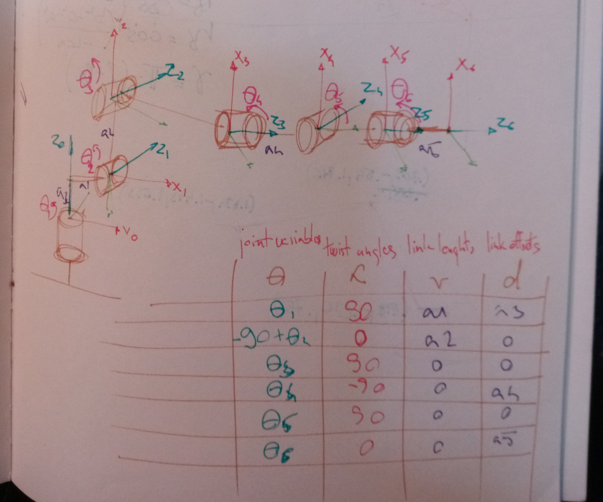
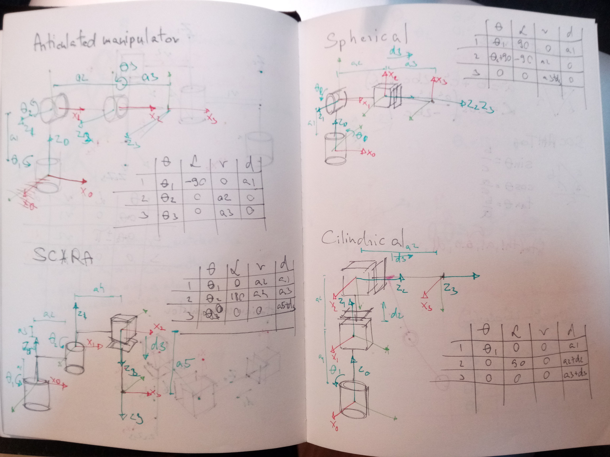
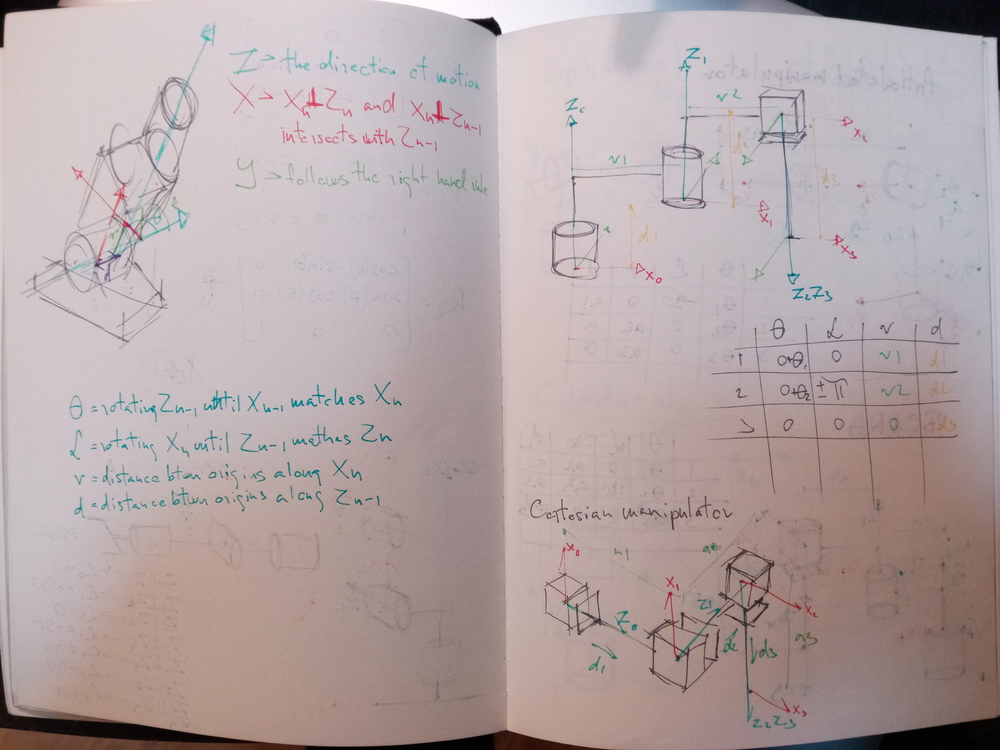
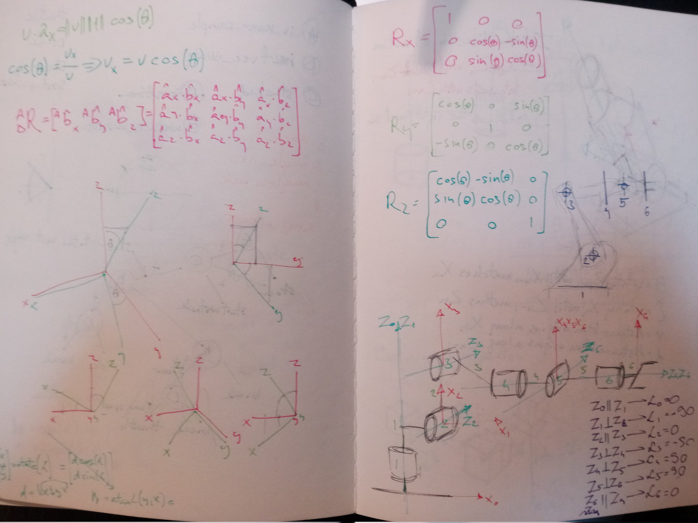
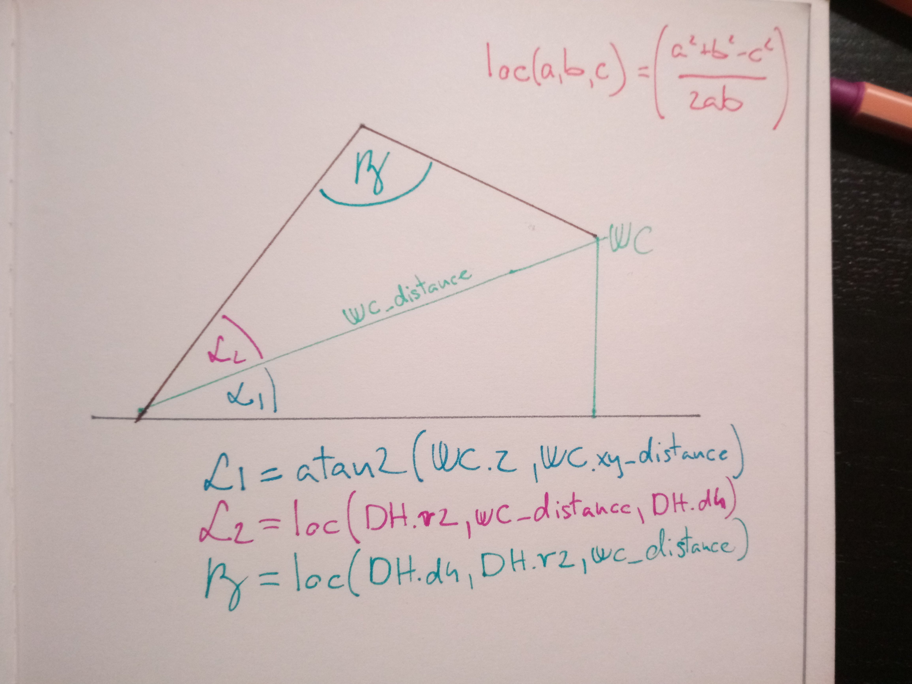

## Project: Kinematics Pick & Place


## [Rubric](https://review.udacity.com/#!/rubrics/972/view) Points
### Here I will consider the rubric points individually and describe how I addressed each point in my implementation.  

---
### Writeup / README

#### 1. Provide a Writeup / README that includes all the rubric points and how you addressed each one.  You can submit your writeup as markdown or pdf.  

You're reading it!

### Kinematic Analysis
#### 1. Run the forward_kinematics demo and evaluate the kr210.urdf.xacro file to perform kinematic analysis of Kuka KR210 robot and derive its DH parameters.

The necessary DH parameters can be derived from the XACRO file by
  - reading out the robot/joint/origin values for links and offsets
  - get robot/link/visual/origin for the angles
  - and robot/link[name="gripper_joint"]/origin for the gripper frame.

But getting the actual values from the lessons made this project much more feasible :)

## DH Parameters
| Joint variables | Twist Angles | Link Offsets | Link Lengths |
|-|-|-|-|
| 0     | 0     | 0.75  | 0 |
| -pi/2 | -pi/2 | 0     | 0.35 |
| 0     | 0     | 0     | 1.25 |
| 0     | -pi/2 | 1.5   | -0.054 |
| 0     | pi/2  | 0     | 0 |
| 0     | -pi/2 | 0     | 0 |
| 0     | 0     | 0.303 | 0 |



I found it very hard to understand the method of building the DH parameters table, but luckily i ran into some great extra tutorials like [this video course](https://www.youtube.com/watch?v=lVjFhNv2N8o&list=PLT_0lwItn0sDBE98BsbaZezflB96ws12b&index=10). I also did some extra practice to stabilize my understanding:





#### 2. Using the DH parameter table you derived earlier, create individual transformation matrices about each joint. In addition, also generate a generalized homogeneous transform between base_link and gripper_link using only end-effector(gripper) pose.

After i had the DH table, building the transformation matrices was pretty straight forward. I defined a function that builds the homogeneous transformation for each line in the DH table and then multiplied those matrices to get the homogeneous transformations matrices between the different joints.

```python
# build a homogeneous transform
def htm(th, a, d, r):
    return Matrix([[cos(th), -sin(th), 0, r],
                   [sin(th)*cos(a), cos(th)*cos(a), -sin(a), -sin(a)*d],
                   [sin(th)*sin(a), cos(th)*sin(a), cos(a), cos(a)*d],
                   [0, 0, 0, 1]])

# build the homogeneous transformations for each join
T0_1 = htm(th1, a0, d1, r0).subs(s)
T1_2 = htm(th2, a1, d2, r1).subs(s)
T2_3 = htm(th3, a2, d3, r2).subs(s)
T3_4 = htm(th4, a3, d4, r3).subs(s)
T4_5 = htm(th5, a4, d5, r4).subs(s)
T5_6 = htm(th6, a5, d6, r5).subs(s)
T6_G = htm(th7, a6, d7, r6).subs(s)

# compose transformations between joints
T0_2 = simplify(T0_1 * T1_2)
T0_3 = simplify(T0_2 * T2_3)
T0_4 = simplify(T0_3 * T3_4)
T0_5 = simplify(T0_4 * T4_5)
T0_6 = simplify(T0_5 * T5_6)
T0_G = simplify(T0_6 * T6_G)
```

#### 3. Decouple Inverse Kinematics problem into Inverse Position Kinematics and inverse Orientation Kinematics; doing so derive the equations to calculate all individual joint angles.

Using the IK_debug.py, i managed to solve the inverse position on my own, but then i had to look in the walk-through video to calculate the inverse orientation.

First i calculated the end effector rotation matrix with the rotations error.
```python
// Calculate the end effector rotation matrix
r, p, y = symbols('r p y')
ROT_x = Matrix([[1, 0, 0],
                [0, cos(r), -sin(r)],
                [0, sin(r), cos(r)]])

ROT_y = Matrix([[cos(p), 0, sin(p)],
                [0, 1, 0],
                [-sin(p), 0, cos(p)]])

ROT_z = Matrix([[cos(y), -sin(y), 0],
                [sin(y), cos(y), 0],
                [0, 0, 1]])
ROT_EE = ROT_z * ROT_y * ROT_x
Rot_Error = ROT_z.subs(y, pi) * ROT_y.subs(p, -pi/2)
ROT_EE = ROT_EE * Rot_Error
ROT_EE = ROT_EE.subs({'r': roll, 'p': pitch, 'y': yaw})

EE = Matrix([[px], [py], [pz]])
```
and then the wrist center with the given equation:
```python
# calculate the wrist center
WC = EE - DH['d7'] * ROT_EE[:, 2]
# the height of the wrist center
wc_z = WC[2] - DH['d1']
# the distance of the WC on the xy plane
wc_xy = sqrt(WC[0]**2 + WC[1]**2) - DH['r1']
# the distance of the WC in space
wc_distance = sqrt(wc_xy ** 2 + (wc_z) ** 2)
```

#### Inverse Position

Once i have the WC i can just use atan2(wc_y, wc_x) to get the orientation of the arm on the xy plane (theta1)
```python
theta1 = atan2(WC[1],WC[0])
```

Since i had the side lenghts of every "triangle" i used the law of cosines to obtain theta2 and theta3

```python
# get an angle based on the three sides of a triangle
#  using the law of cosines
def loc(a, b, c):
    rad = acos((a**2 + b**2 - c**2) / (2 * a * b))
    return rad

theta1 = atan2(WC[1],WC[0])

alpha_a = atan2(wc_z, wc_xy)
alpha_b = loc(DH['r2'], wc_distance, DH['d4'])
theta2 = -((alpha_a + alpha_b) + DH['th2'])

theta3 = -(loc(DH['d4'], DH['r2'], wc_distance) - pi/2)
```
#### Inverse orientation

To calculate theta4-6, first i have to calculate the rotation matrix between link 3-6, the derive the Euler Angles from this matrix.

```python
# extract the rotation matrice from 0-3
R0_3 = T0_1[0:3,0:3] * T1_2[0:3,0:3] * T2_3[0:3,0:3]
# subtitute theta1-3
R0_3 = R0_3.evalf(subs={th1: theta1, th2: theta2, th3: theta3})
# get the rotation matric from 3-6
R3_6 = R0_3.inv("LU") * ROT_EE

# calculate theta4-6 using the methods described in lession11/8
#  Euler angles from Rotation Matrix
theta4 = atan2(R3_6[2,2], -R3_6[0,2])
theta5 = atan2(sqrt(R3_6[0,2]*R3_6[0,2] + R3_6[2,2]*R3_6[2,2]), R3_6[1,2])
theta6 = atan2(-R3_6[1,1], R3_6[1,0])

return theta1, theta2, theta3, theta4, theta5, theta6
```

### Project Implementation

#### 1. Fill in the `IK_server.py` file with properly commented python code for calculating Inverse Kinematics based on previously performed Kinematic Analysis. Your code must guide the robot to successfully complete 8/10 pick and place cycles. Briefly discuss the code you implemented and your results.

I moved my calculations into [calculate_IK.py](kuka_arm/scripts/calculate_IK.py) and imported it in both `IK_debug.py` and `IK_server.py`.

Using my implementation, the robot makes a lot of extra movements before it reaches the target position. I think it's because while my resulted thetas are mostly correct they are not always between the joint limits. Although it's quite slow, the robot gets the job done every time :)

I should think about how to solve this "dancing issue" in the future.

I think i have a basic understanding about the concepts introduced in this lesson, but i'll definitely have to gain deeper knowledge about the math behind inverse kinematics.

![alt text][image3]


[//]: # (Image References)

[image1]: ./misc_images/misc1.png
[image2]: ./misc_images/misc3.png
[image3]: ./misc_images/misc2.png
